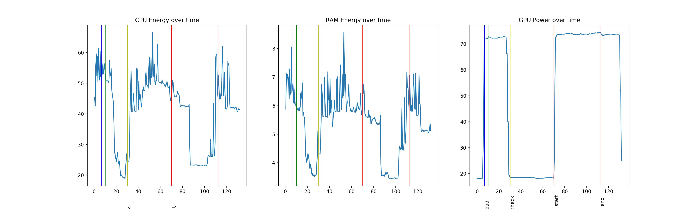

# Tool Demos
This sub-package contains modules that allow you to demo the tool, to test it manually or demonstrate how it works. The most advanced demo can be found in `run_demo.py`, which contains the function `demo_start_end_time_graphing`. This can be used to generate graphs like this:  

It also contains a range of other plotting functions for the energy data in `plot_energy.py`. You can browse some graphs created by these functions in `/graphs`.